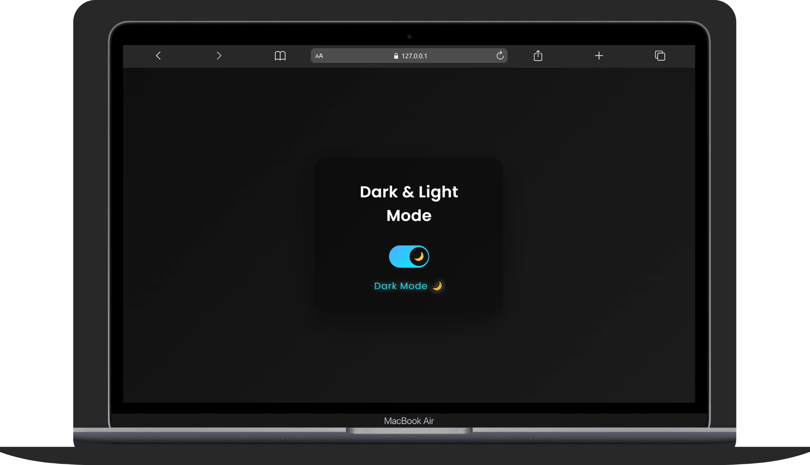
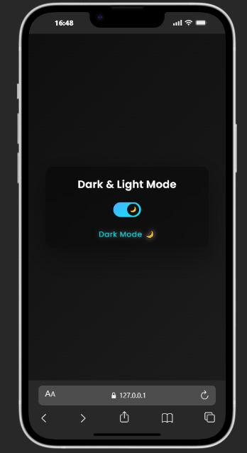

# 🌗 Dark / Light Mode Toggle – Modern UI Switch

🔗 [Live Demo](https://mode.webdevzone.in)

🚀 A modern, responsive Dark/Light mode toggle with smooth animations, glassmorphism UI, and persistent theme storage.
Built to practice UI/UX design, CSS animations, and state management using JavaScript.

---

## 📌 Tech Stack

- 🧱 HTML5
- 🎨 CSS3
- ⚙️ JavaScript

---

## ✨ Features

- 🌞 Light Mode / 🌙 Dark Mode toggle
- 🎬 Smooth sliding animation (transform-based)
- 🎨 Glassmorphism modern UI design
- ⚡ Instant theme switching
- 💾 Theme saved using `localStorage`
- 🔄 Dynamic mode text display
- ✨ Icon transition (Sun ↔ Moon)
- 📱 Fully responsive (Mobile → Desktop)
- 🚫 No layout shift or animation glitch

---

## 🚀 Key Highlights

- 🎯 Smooth Toggle Animation – Uses `transform` for GPU-accelerated sliding
- 🎨 Modern UI – Gradient background + glass effect
- 📱 Responsive Design – Built using `clamp()` for all screen sizes
- 💾 Persistent State – Remembers user preference
- 🧠 Clean Code – Beginner-friendly + scalable structure
- 🌗 Dynamic Icons – Auto-switch based on mode

---

## 📸 Screenshots

> 📸 
> 📸 

---

## 🛠️ Installation

Follow these steps to run the project locally:

```bash
# 1. Clone the repository
git clone https://github.com/webdev-desktop/Dark-Light-Toggle.git

# 2. Navigate to the folder
cd Dark-Light-Toggle

# 3. Open in browser
Open index.html
```

---

## ▶️ Usage

1. Click on the toggle switch 🎚
2. Switch between Light 🌞 and Dark 🌙 mode
3. Observe smooth sliding animation 🎬
4. Check dynamic text update 🧠
5. Refresh page → mode stays saved 💾

---

## 🔮 Future Improvements

- 🌗 Advanced toggle animation (SVG morph)
- 🎬 Physics-based animation (GSAP)
- 🎨 Multiple theme options
- 📱 Full settings panel UI
- 🌐 Theme sync across devices

---

## 🤝 Contribution

Contributions are welcome!

```bash
# Fork the repo
# Create a new branch
git checkout -b feature/your-feature

# Commit changes
git commit -m "Add your feature"

# Push to branch
git push origin feature/your-feature
```

Then open a Pull Request 🚀

---

## 👨‍💻 Author

**Apurv**

- [GitHub](https://github.com/webdev-desktop)

---

## 📄 License

This project is licensed under the **MIT License**.

---

## ⭐ Support

If you like this project, don’t forget to star ⭐ the repo and share it!
